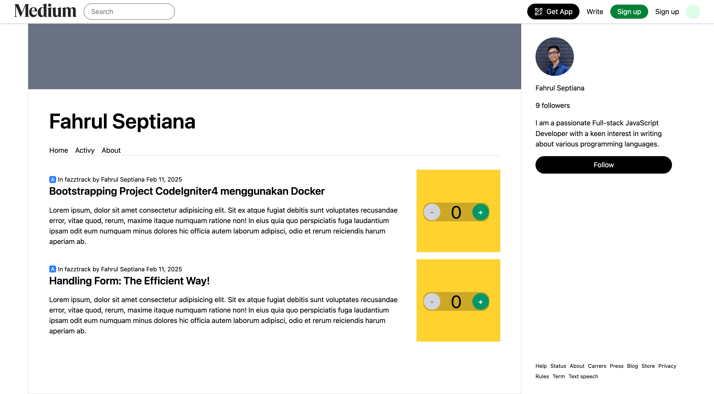
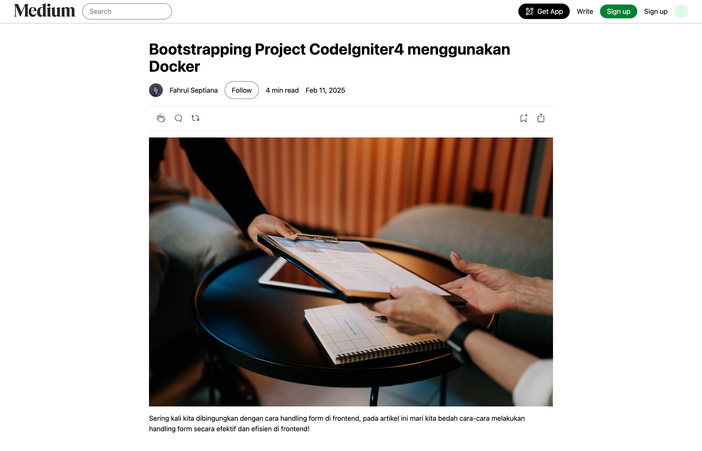

# Medium Clone

A simple Medium-inspired application built with React, Vite, and Tailwind CSS. This project demonstrates dynamic routing for user profiles and article pages.

## Tech Stack

- React
- Vite
- Tailwind CSS

## Routing
* `/:username`  User profile page
* `/:username/:slug`  User article page

## Preview

| Profile Page | Article Page |
| :---: | :---: |
|  |  |

---


## Installation

```bash
git clone https://github.com/zackyrafian/koda-b8-react6
cd koda-b8-react6
npm install
npm run dev
```

